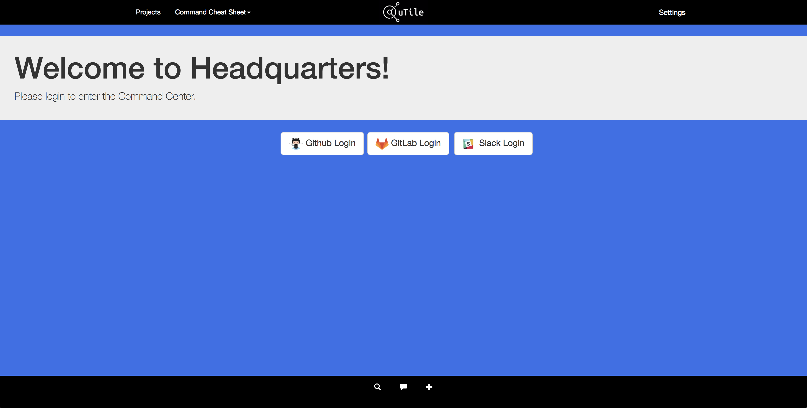
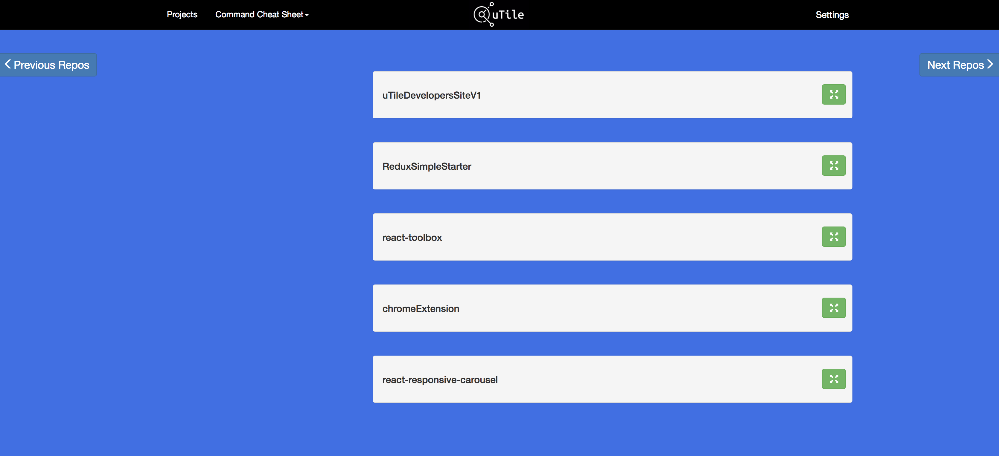
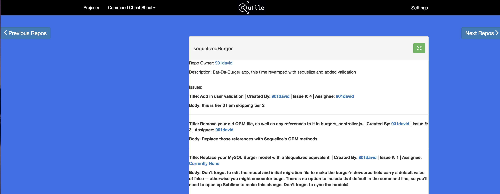
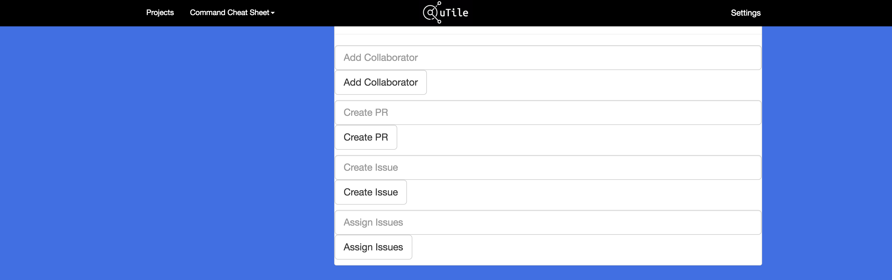
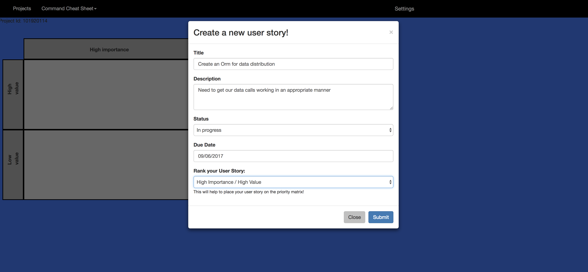
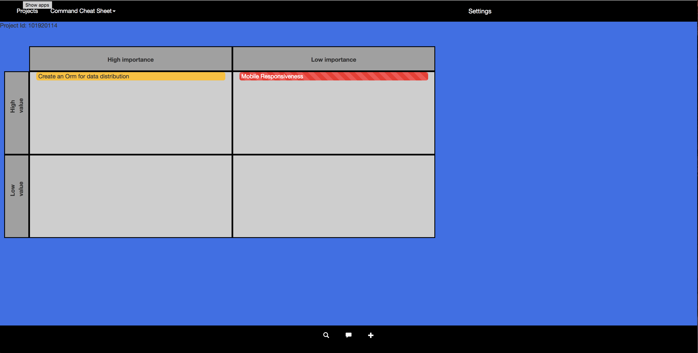
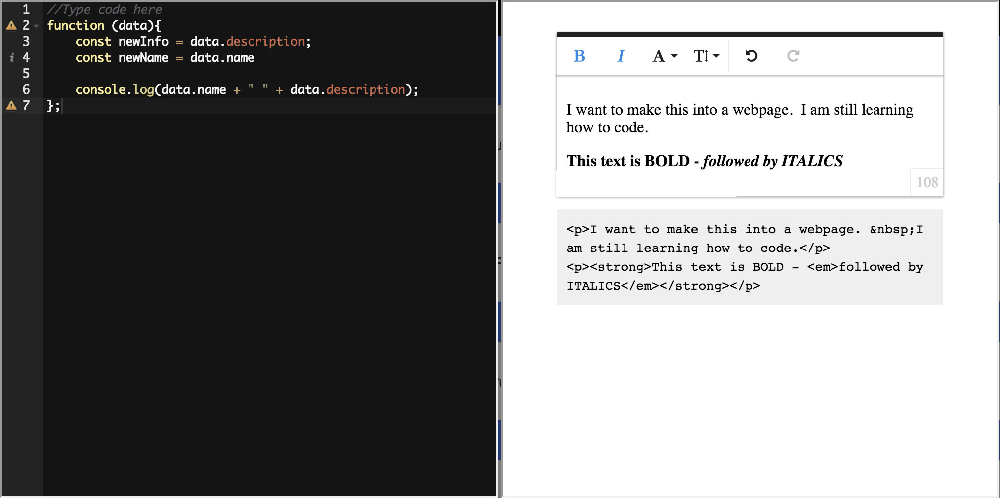

# uTile Developer's Application

## Purpose

This site was created to allow developer's to interact with their GitHub in an effective and quick manner to manage projects and tasks in a streamlined manner.

## Features

* GitHub repository management

  From your projects view you are able to manage all of your GitHub repositories. Once a repo is opened up you are able to view all open issues, and who they are assigned.  In this view you are also able to add collaborators to your repos, add active issues, create pull requests and assign existing issues. This allows users to quickly use inline commands to accomplish several tasks in one location.

  ### Repository Management
  

  ### View Issues/Assignees
  

  ### Interact with GitHub
  

* Task Management through the Matrix

  In this view, users are also able to enter into the matrix for each project. This is a grid that allows users to create user stories and place them into a specific category.  These are:  Low Importance, or High Importance, which also include two categories, High Value and Low Value.  This allows a user to create a user story and prioritize exactly its importance and value and maximizes collaboration.  

  ### Create User Stories
  

  ### Manage User stories
  

* Code writing and building

  Also available in the projects area, are the ability to write syntax highlighted code that can be copied and pasted into something else.  If you have some thing on yoru mind you have to get down NOW before it is forgotten, or you just want to tool around with some javascript, you are able to write code with dynamic syntax highlighting to help you out. In addition, there is a window where you are able to write in plain text and insert images, videos and files in a similar manner to a word document and the it is converted into html code that a user could copy and paste into their favorite coding IDE.

  

* Where to go?

  We are currently working on version 2 of this application.  It is being built in React, and will basically be the same features.  We are hoping to create a more robust interface for users when interacting with GitHub and also tie in Slack as well.  Alot of the limitations on this version were because we were using Handlebars and did not have acces to two way data binding.  Keep your eyes peeled for Version 2.
